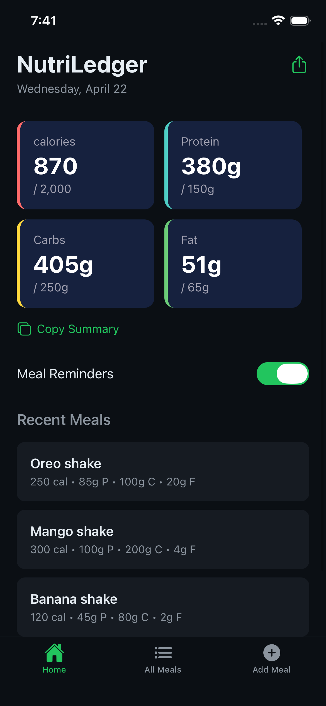
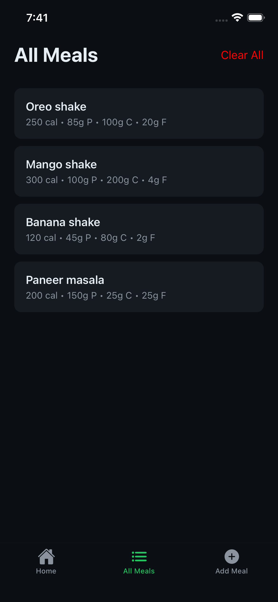
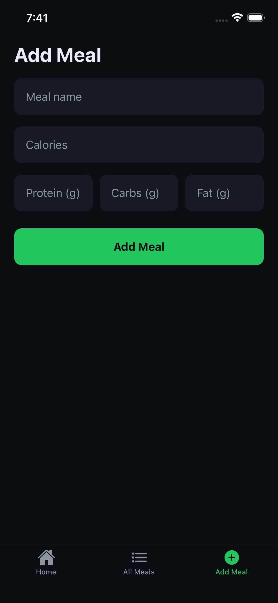

# NutriLedger 🥗

A modern macro tracking application built with React Native, designed to help users monitor daily nutrition with clarity and efficiency.

---

## 🚀 Overview

NutriLedger enables users to log meals and track key nutritional metrics including calories, protein, carbohydrates, and fats. The app delivers a streamlined experience with a clean interface and structured data presentation.

---

## ✨ Key Features

- 📊 Real-time macro tracking (Calories, Protein, Carbs, Fat)
- ➕ Seamless meal logging and management
- 📅 Daily overview with date-based tracking
- 🧩 Structured UI with macro summary cards
- ⚡ Fast and responsive mobile experience

---

## 📱 Screenshots

---

## 🛠️ Tech Stack

- React Native
- JavaScript / TypeScript
- Expo (if used)
- Async Storage / Local State Management

---

## 🧠 Design Approach

- Clarity in data representation
- Minimal and intuitive user experience
- Smooth performance across screens

---

## 📱 Core Screens

- Home Screen — Daily macro summary and recent meals
- Add Meal Screen — Input and save meal data
- Meals Screen — View all logged meals

---

## 👤 Author

Shubham Sinha
